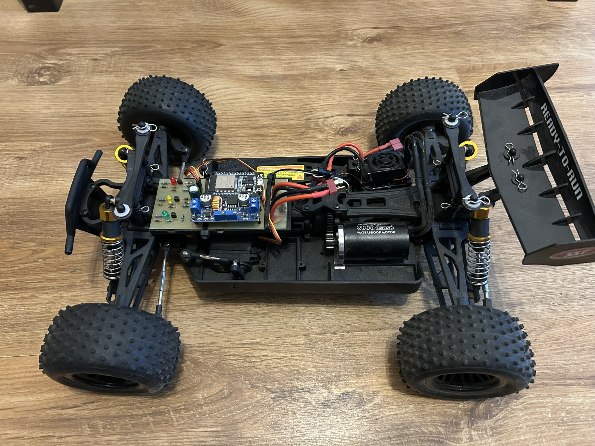
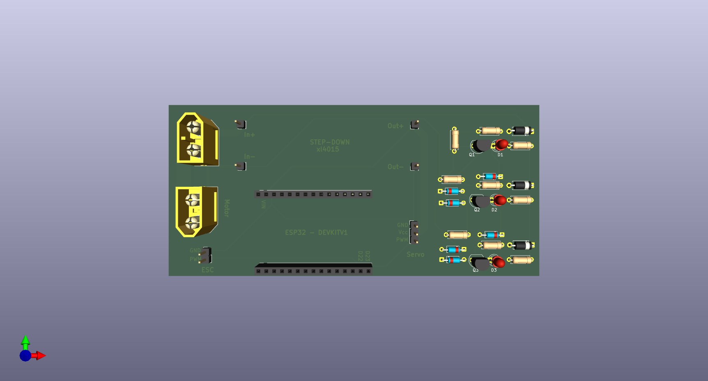
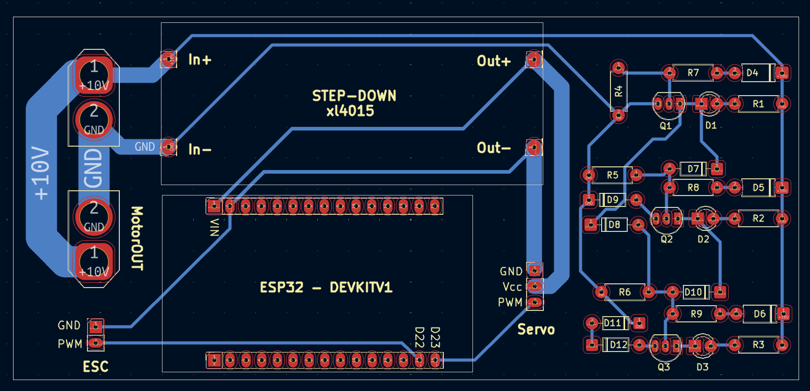
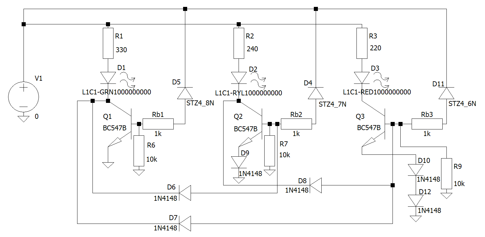
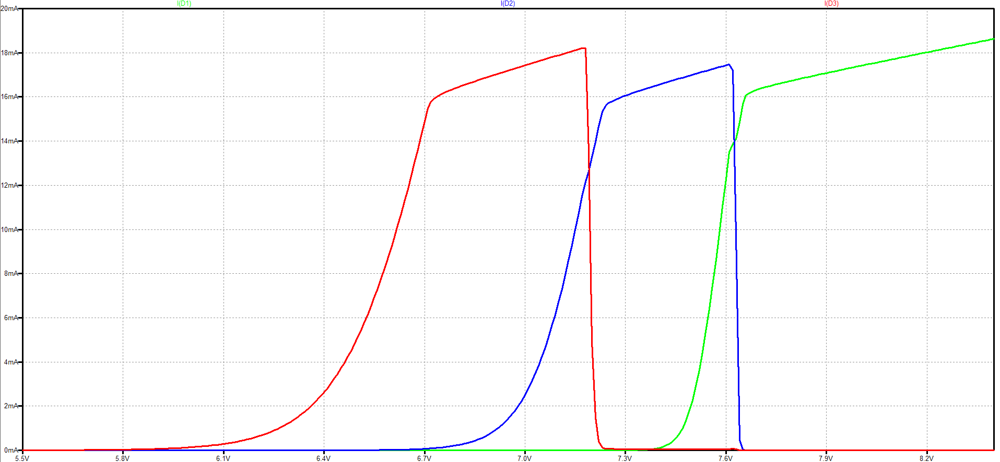

# ESP32 Bluetooth RC Car



Wireless RC vehicle controlled by an Xbox controller over Bluetooth.

The vehicle uses an ESP32-DevKitV1 as the main controller. The ESP32 receives commands from the Xbox controller, processes the input and generates PWM signals for the ESC and steering servo.

The system also includes a custom PCB, power distribution, battery status indication and software safety mechanisms.

## Features

- Xbox controller input over Bluetooth
- ESP32-based control system
- Brushless motor control through ESC
- Servo-based steering
- Progressive acceleration (Soft Start)
- Safe direction switching through neutral
- Run / Stop functionality
- Normal and Sport driving modes
- Battery voltage indication
- Custom PCB
- Fail-safe behavior after Bluetooth disconnection

## System Architecture

```text
Xbox Controller
      │
   Bluetooth
      │
      ▼
    ESP32
   │     │
   │     └──────► Steering Servo
   │
   └────────────► ESC ─────► Brushless Motor


LiPo Battery
      │
      ├──────────► Power Distribution
      ├──────────► Voltage Indicator
      │
      └──────────► XL4015 Step-Down
                         │
                         ├────► ESP32
                         └────► Servo
```

## How It Works

1. The Xbox controller connects to the ESP32 over Bluetooth.
2. The ESP32 reads the controller inputs and processes the commands.
3. Throttle and steering inputs are converted into PWM signals for the ESC and steering servo.
4. The battery voltage is indicated by a dedicated analog LED circuit.
5. If the Bluetooth connection is lost, the vehicle returns to a safe state.

## Hardware

- ESP32-DevKitV1
- Brushless motor
- Electronic Speed Controller (ESC)
- Steering servo
- LiPo battery
- XL4015 step-down converter
- Custom PCB
- Battery voltage indicator

## Software

- C++
- Arduino IDE
- ESP32
- Bluepad32
- ESP32Servo
- Bluetooth
- PWM

## Motor Control

The brushless motor is controlled through an Electronic Speed Controller (ESC) using a 50 Hz PWM signal.

The firmware uses:

- `1000 µs` — minimum
- `1500 µs` — neutral
- `2000 µs` — maximum

Two driving modes are available:

- **Normal**
- **Sport**

A Soft Start mechanism limits the rate at which the motor command increases.

## Steering Control

Steering is controlled using the horizontal axis of the Xbox controller.

A configurable dead zone prevents unwanted steering caused by small joystick movements.

The joystick input is mapped to the steering servo PWM range for proportional steering control.

## Safety Features

The firmware includes several mechanisms designed to prevent uncontrolled movement:

- motor output returns to neutral when the controller disconnects
- steering returns to the center position
- switching between forward and reverse requires passing through neutral
- Run / Stop functionality
- trigger dead zone
- steering dead zone
- controlled acceleration

## Hardware Design

The project includes a custom PCB integrating the ESP32, ESC interface, steering servo interface, power distribution and analog battery voltage indicator.

The PCB was designed in KiCad and the battery voltage indicator was analyzed in LTspice.

### PCB Design





### Analog Battery Voltage Indicator

The battery voltage indicator was designed and analyzed in LTspice.



The simulation was used to analyze the voltage thresholds and LED current characteristics of the indicator circuit.



### Design Files

- [KiCad PCB project](hardware/kicad/rc-car.kicad_pcb)
- [KiCad schematic](hardware/kicad/rc-car.kicad_sch)
- [KiCad project](hardware/kicad/rc-car.kicad_pro)
- [LTspice circuit](hardware/ltspice/battery-indicator.asc)


## My Contribution

This was a team project.

My contribution included:

- electrical schematic design
- PCB design in KiCad
- PCB assembly and soldering
- hardware integration
- system testing

## Project Status

**Completed and tested.**

## Possible Improvements

- Add obstacle detection
- Add Wi-Fi telemetry
- Add mobile monitoring
- Add live camera streaming
- Add additional sensors
- Add autonomous driving functionality

## Authors

- Konrad Misztela
- Miriam Witiw
- Maks Hula
- Mateusz Bochenek